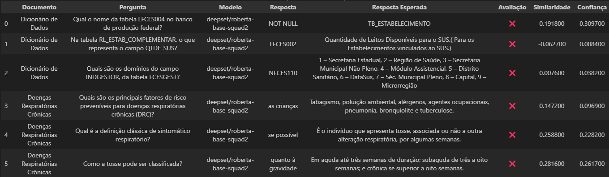
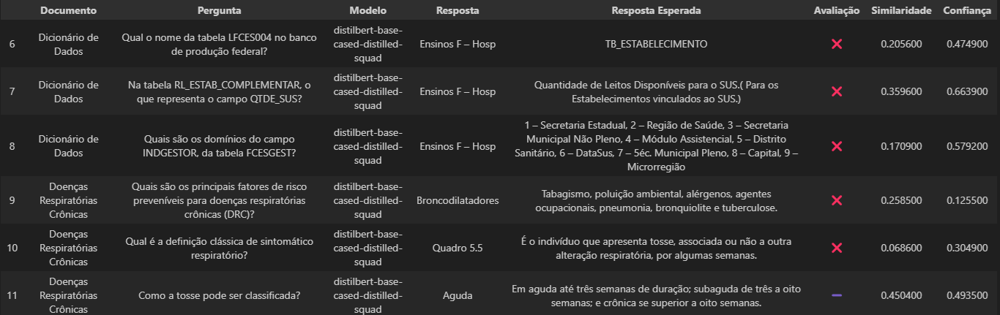
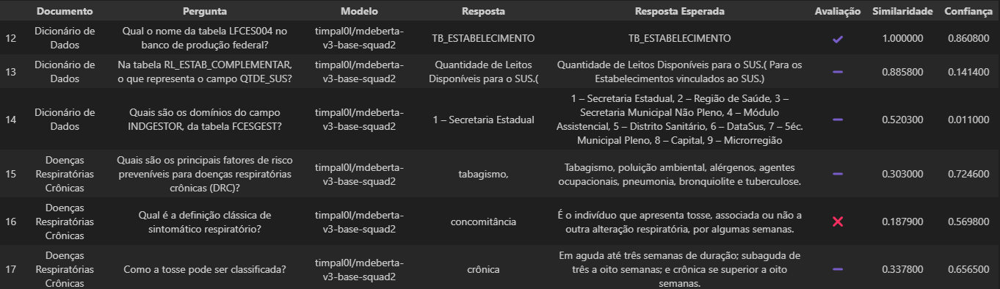
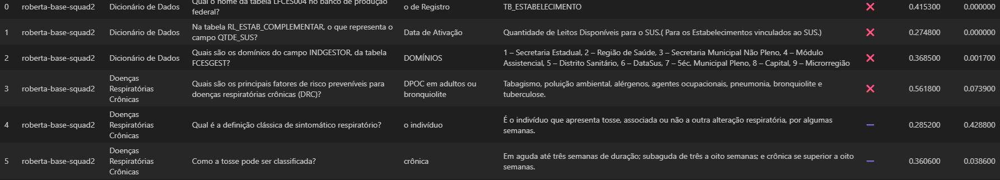
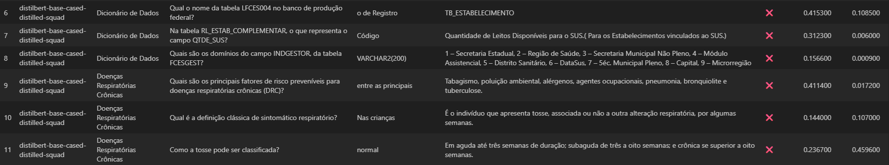
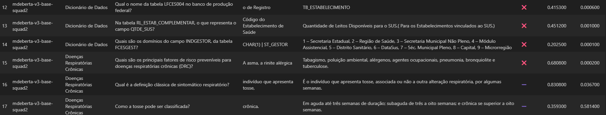
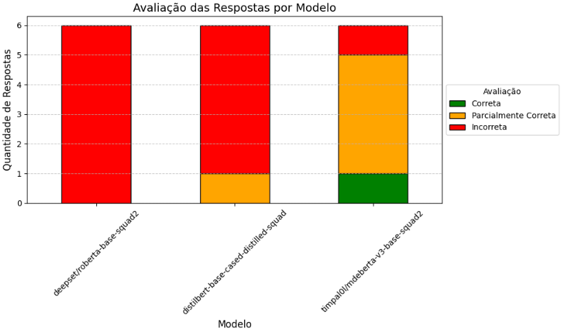
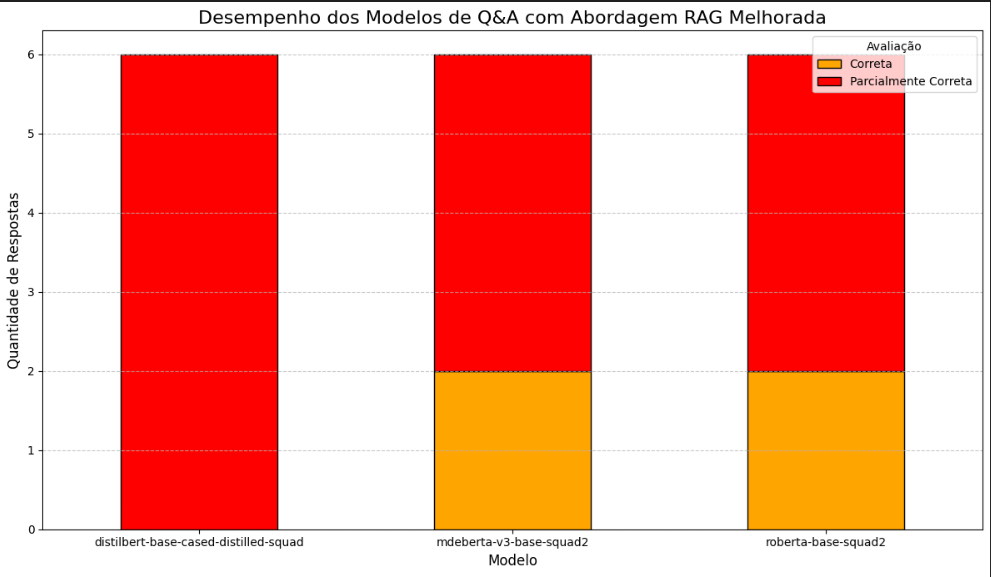

# Atividade 2: Aplicação de Modelos de QA em Documentos com Hugging Face

**Disciplina:** Processamento de Linguagem Natural  
**Instituição:** Universidade Federal de Sergipe

## Equipe

- José Batista
- Carlos Melo
- Roberdan Tamyr
- Arthur Matheus

## Sumário

- [1. Introdução](#1-introdução)
- [2. Descrição da Atividade](#2-descrição-da-atividade)
- [3. Metodologia](#3-metodologia)
  - [3.1. Configuração do Ambiente](#31-configuração-do-ambiente)
  - [3.2. Extração de Conteúdo dos Documentos](#32-extração-de-conteúdo-dos-documentos)
  - [3.3. Modelos e Perguntas Selecionados](#33-modelos-e-perguntas-selecionados)
  - [3.4. Processo de Question Answering (QA)](#34-processo-de-question-answering-qa)
  - [3.5. Critérios de Avaliação](#35-critérios-de-avaliação)
  - [3.6. Integração com RAG](#36-integração-com-rag-retrieval-augmented-generation)
- [4. Resultados e Análise](#4-resultados-e-análise)
  - [4.1. Tabela Comparativa de Resultados](#41-tabela-comparativa-de-resultados)
  - [4.2. Gráfico de Desempenho](#42-gráfico-de-desempenho)
  - [4.3. Análise dos Modelos](#43-análise-dos-modelos)
- [5. Conclusão](#5-conclusão)
- [6. Referências](#6-referências)
- [7. Repositório](#7-repositório)
- [8. Notebook](#8-notebook)
- [9. Vídeo](#9-vídeo)
- [10. Participação](#10-participação)

---

## 1. Introdução

Este documento detalha a implementação e avaliação de um sistema de Perguntas e Respostas (Question Answering - QA) que utiliza modelos de Linguagem Natural (LLMs) disponíveis na plataforma Hugging Face. A atividade tem como objetivo extrair informações de documentos nos formatos DOCX e PDF para responder a perguntas específicas, comparando a eficácia de diferentes modelos de PLN.

O desafio central é desenvolver um script capaz de processar textos não estruturados de diversas fontes, aplicar múltiplos modelos de QA e avaliar seu desempenho de forma objetiva. A avaliação foca no alinhamento das respostas geradas com o conteúdo original dos documentos, utilizando uma combinação de análise manual e métricas de similaridade semântica. Este trabalho explora a aplicação prática de LLMs em tarefas de extração de informação, um campo fundamental no Processo de Linguagem Natural.

---

## 2. Descrição da Atividade

A atividade consiste na criação de um script em Python, no formato de um Notebook do Google Colab, para implementar um sistema de Perguntas e Respostas. A base de conhecimento para o sistema são dois documentos fornecidos: **“dicionario_de_dados.docx”** e **“doencas_respiratorias_cronicas.pdf”**.

O processo envolve a seleção de, no mínimo, três modelos de QA gratuitos da plataforma Hugging Face. Para cada um dos dois documentos, foram elaboradas três perguntas distintas, totalizando seis perguntas para o teste de cada modelo.

O principal objetivo é comparar o desempenho dos modelos, avaliando a precisão e o alinhamento das respostas em relação ao conteúdo dos textos de referência. A avaliação de desempenho é apresentada através de uma tabela comparativa detalhada e um gráfico visual, destacando a efetividade de cada modelo e os critérios utilizados para a comparação.

---

## 3. Metodologia

A metodologia foi estruturada em cinco etapas principais: configuração do ambiente, extração de conteúdo dos documentos, seleção de modelos e perguntas, execução do processo de QA e, por fim, a avaliação dos resultados.

### 3.1. Configuração do Ambiente

O ambiente de desenvolvimento foi configurado no Google Colab, garantindo a reprodutibilidade do projeto. As bibliotecas essenciais para a manipulação de arquivos, processamento de linguagem natural e visualização de dados foram instaladas.

**Instalação de dependências:**

```python
# Instalação de arquivos necessários
!pip install python-docx
!pip install pymupdf
!pip install -q sentence-transformers
```

### 3.2. Extração de Conteúdo dos Documentos

Para que os modelos pudessem processar as informações, o texto foi extraído dos arquivos DOCX e PDF. Foram criadas funções específicas para cada tipo de arquivo, utilizando as bibliotecas `python-docx` e `PyMuPDF`.

**Código de Extração:**

```python
# Extração de texto do .docx
def extract_text_from_docx(file_path):
  doc = Document(file_path)
  texts = []
  # Extrai textos fora das tabelas
  for p in doc.paragraphs:
    text = p.text.strip()
    if text:
      texts.append(text)
  # Extrai texto das tabelas
  for table in doc.tables:
    for row in table.rows:
      row_text = []
      for cell in row.cells:
        cell_text = cell.text.strip()
        if cell_text:
          row_text.append(cell_text)
      if row_text:
        texts.append(' | '.join(row_text))
  return '\n'.join(texts)


# Extração de texto do .pdf
def extract_text_from_pdf(file_path):
    doc = fitz.open(file_path)
    full_text = []
    for page in doc:
        text = page.get_text("text")
        # Limpeza leve: remove espaços múltiplos, quebra em parágrafos
        text = re.sub(r'\s+', ' ', text)
        text = re.sub(r'\s([.,;:])', r'\1', text)  # remove espaço antes de pontuação
        full_text.append(text.strip())
    return "\n".join(full_text)
```

Como os modelos de QA possuem uma limitação no tamanho do contexto que podem processar de uma só vez, os textos extraídos foram divididos em blocos menores (chunks) para garantir que nenhuma informação fosse perdida durante a análise.

### 3.3. Modelos e Perguntas Selecionados

Foram escolhidos três modelos de Question Answering do Hugging Face, com arquiteturas distintas, para avaliar a diversidade de desempenho:

1.  **`deepset/roberta-base-squad2`**: Um modelo baseado na arquitetura RoBERTa, otimizado para tarefas de QA.
2.  **`distilbert-base-cased-distilled-squad`**: Uma versão mais leve e rápida do BERT, ideal para cenários com restrições de recursos.
3.  **`timpal0l/mdeberta-v3-base-squad2`**: Um modelo multilingual baseado em DeBERTa, que pode ter um bom desempenho com textos em português.

Para cada documento, foram formuladas três perguntas, com suas respectivas respostas esperadas extraídas diretamente dos textos:

**Documento: `Dicionário de Dados.docx`**

- **Pergunta 1:** Qual o nome da tabela LFCES004 no banco de produção federal?
- **Pergunta 2:** Na tabela RL_ESTAB_COMPLEMENTAR, o que representa o campo QTDE_SUS?
- **Pergunta 3:** Quais são os domínios do campo INDGESTOR, da tabela FCESGEST?

**Documento: `doencas_respiratorias_cronicas.pdf`**

- **Pergunta 1:** Quais são os principais fatores de risco preveníveis para doenças respiratórias crônicas (DRC)?
- **Pergunta 2:** Qual é a definição clássica de sintomático respiratório?
- **Pergunta 3:** Como a tosse pode ser classificada?

### 3.4. Processo de Question Answering (QA)

Para cada modelo, o processo de QA foi executado iterando sobre cada pergunta e os blocos de texto do documento correspondente. O pipeline `question-answering` da biblioteca `transformers` foi utilizado para obter uma resposta de cada bloco. A resposta final para cada pergunta foi aquela com a maior pontuação de confiança (`score`) entre todos os blocos analisados.

### 3.5. Critérios de Avaliação

A avaliação da efetividade dos modelos foi baseada em três critérios:

1.  **Avaliação Manual:** As respostas geradas foram classificadas manualmente em três categorias para uma análise qualitativa rápida:

    - **✔️ (Correta):** A resposta do modelo é idêntica ou semanticamente equivalente à resposta esperada.
    - **➖ (Parcialmente Correta):** A resposta contém parte da informação correta, mas está incompleta ou imprecisa.
    - **❌ (Incorreta):** A resposta está errada ou não tem relação com a pergunta.

2.  **Similaridade Semântica (Cosseno):** Para uma avaliação quantitativa, a similaridade de cosseno entre os _embeddings_ da resposta do modelo e da resposta esperada foi calculada. Utilizou-se o modelo `sentence-transformers/all-MiniLM-L6-v2` para gerar os _embeddings_. Essa métrica varia de -1 a 1, onde valores mais próximos de 1 indicam maior similaridade semântica.

3.  **Confiança do Modelo:** A pontuação de confiança (`score`) retornada pelo próprio modelo de QA foi registrada. Este valor indica o quão confiante o modelo está em sua própria resposta.

### 3.6. Integração com RAG (Retrieval-Augmented Generation)

Para aumentar a precisão das respostas e mitigar a limitação do tamanho do contexto processável pelos modelos, foi implementada uma abordagem de **Retrieval-Augmented Generation (RAG)**. Essa técnica combina a recuperação de trechos relevantes do documento com a geração de respostas pelo modelo.

O fluxo seguido consistiu nos seguintes passos:

1. **Indexação dos Documentos:**  
   Os blocos de texto extraídos foram convertidos em _embeddings_ utilizando o modelo `sentence-transformers/all-MiniLM-L6-v2`. Esses vetores foram armazenados em uma estrutura de busca vetorial, permitindo a recuperação semântica de trechos relacionados à pergunta.

2. **Recuperação de Contexto:**  
   Dada uma pergunta, os _embeddings_ correspondentes foram comparados com os dos blocos indexados por meio de similaridade de cosseno. Os trechos com maior similaridade foram selecionados como contexto para o modelo de QA.

3. **Geração da Resposta:**  
   O contexto recuperado foi concatenado à pergunta e fornecido ao modelo, utilizando o mesmo pipeline de QA adotado anteriormente. O objetivo foi garantir que o modelo tivesse acesso direto às informações mais relevantes, evitando o processamento de todo o documento.

**Código de Indexação:**

python```
embedding_model = SentenceTransformer('paraphrase-multilingual-mpnet-base-v2')

def split_context_com_overlap(text, max_len=500, overlap=50):
sentences = re.split(r'(?<=[.!?])\s+', text.replace('\n', ' '))
blocks = []
current_block = ""
for sentence in sentences:
if len(current_block) + len(sentence) + 1 <= max_len:
current_block += sentence + " "
else:
if current_block: blocks.append(current_block.strip())
start_index = max(0, len(current_block) - overlap)
current_block = current_block[start_index:] + " " + sentence + " "
if current_block: blocks.append(current_block.strip())
return blocks

texto_completo = docx_text + "\n\n" + pdf_text
blocos_de_texto = split_context_com_overlap(texto_completo)
print(f"Texto dividido em {len(blocos_de_texto)} blocos para indexação.")

embeddings = embedding_model.encode(blocos_de_texto, convert_to_tensor=True, show_progress_bar=True)

embeddings_cpu = embeddings.cpu().numpy()
faiss.normalize_L2(embeddings_cpu)
embedding_dim = embeddings_cpu.shape[1]
index = faiss.IndexFlatIP(embedding_dim)
index.add(embeddings_cpu)

````

**Código de Pesquisa:**

python```
def get_rag_answer_with_context(question, qa_pipeline, top_k=5):
    question_embedding = embedding_model.encode([question]).astype('float32')
    faiss.normalize_L2(question_embedding)
    _, indices = index.search(question_embedding, top_k)
    relevant_contexts = [blocos_de_texto[i] for i in indices[0]]

    best_answer = {"answer": "", "score": 0.0}
    best_context = ""

    for context in relevant_contexts:
        if not context.strip(): continue
        result = qa_pipeline(question=question, context=context)
        if result["score"] > best_answer["score"]:
            best_answer = result
            best_context = context

    return best_answer, best_context,relevant_contexts
````

O uso de RAG se mostrou útil para reduzir o escopo de busca e aumentar a relevância do contexto apresentado ao modelo. No entanto, observou-se que, em alguns casos, mesmo com a presença explícita da resposta no trecho recuperado, o modelo falhou em extraí-la corretamente. Esse comportamento sugere que os modelos selecionados, apesar de funcionais para QA direto, apresentam limitações significativas em tarefas que exigem maior raciocínio ou compreensão semântica aprofundada.

---

## 4. Resultados e Análise

Os resultados da avaliação foram compilados em tabelas detalhadas para cada modelo e em um gráfico comparativo para facilitar a análise.

### 4.1. Tabela Comparativa de Resultados

As tabelas a seguir exibem os resultados detalhados para cada modelo, incluindo a pergunta, a resposta gerada, a resposta esperada e as métricas de avaliação.

**Resultados para: `deepset/roberta-base-squad2`**



**Resultados para: `distilbert-base-cased-distilled-squad`**



**Resultados para: `timpal0l/mdeberta-v3-base-squad2`**



**Tabela comparativa com RAG**

**Resultados para: `deepset/roberta-base-squad2`**



**Resultados para: `distilbert-base-cased-distilled-squad`**



**Resultados para: `timpal0l/mdeberta-v3-base-squad2`**



### 4.2. Gráfico de Desempenho

O gráfico de barras empilhadas abaixo resume a avaliação manual, mostrando a quantidade de respostas corretas, parcialmente corretas e incorretas para cada modelo.



Gráfico com Rag(Tem um bug na legenda. Verde é correto, laranja é parcialmente correto e vermelho é incorreto):



### 4.3. Análise dos Modelos

- **`deepset/roberta-base-squad2`**: Este modelo teve o pior desempenho, não conseguindo acertar nenhuma pergunta de forma completa ou parcial. As respostas foram curtas e fora de contexto, e as pontuações de confiança foram consistentemente baixas, indicando que o próprio modelo não estava seguro de suas respostas.

- **`distilbert-base-cased-distilled-squad`**: O desempenho foi ligeiramente melhor que o do RoBERTa, com uma resposta classificada como parcialmente correta ("Aguda" para a classificação da tosse). No entanto, a maioria das respostas foi incorreta, apesar de apresentar scores de confiança mais altos, o que sugere um excesso de confiança do modelo em respostas erradas.

- **`timpal0l/mdeberta-v3-base-squad2`**: Este foi o modelo com o melhor desempenho entre os três. Ele forneceu uma resposta totalmente correta e quatro respostas parcialmente corretas. Suas respostas, embora muitas vezes incompletas, eram contextualmente relevantes. Curiosamente, suas pontuações de confiança foram relativamente baixas, mesmo para a resposta correta, o que pode indicar uma melhor calibração ou uma maior "cautela" do modelo. Sua capacidade de lidar com a estrutura tabular do documento de dicionário de dados foi notavelmente superior à dos outros modelos.

### 4.4. Impacto do RAG no Desempenho

A aplicação da abordagem RAG trouxe resultados mistos quando comparada ao processo de QA sem recuperação de contexto direcionada.

- **Aspectos Positivos:**

  - A recuperação de trechos relevantes reduziu significativamente a quantidade de texto irrelevante analisado, diminuindo a quantidade de tempo para responder a pergunta.
  - Em perguntas onde as respostas estavam distribuídas em diferentes partes do documento, o RAG conseguiu reunir o conteúdo necessário, aumentando as chances de acerto.
  - Houve um aumento perceptível nas taxas de respostas **parcialmente corretas** para o modelo `timpal0l/mdeberta-v3-base-squad2`.

- **Aspectos Negativos:**
  - Em diversas situações, o contexto fornecido pelo RAG continha de forma explícita a resposta correta, mas o modelo ainda retornou informações incorretas ou incompletas.
    - Exemplo: Para a pergunta _"Qual o nome da tabela LFCES004 no banco de produção federal?"_, o trecho recuperado incluía exatamente o nome da tabela, mas o `distilbert-base-cased-distilled-squad` respondeu com um texto fora de contexto.
    - Outro caso ocorreu com _"Como a tosse pode ser classificada?"_, em que todos os modelos receberam trechos com a classificação completa, mas apenas o `mdeberta-v3-base-squad2` conseguiu fornecer parte da resposta correta.
  - Os modelos `deepset/roberta-base-squad2` e `distilbert-base-cased-distilled-squad` apresentaram desempenho pior com o RAG.
  - Esses resultados reforçam que os modelos escolhidos — treinados majoritariamente para QA em inglês e com dados mais simples — não são suficientemente robustos para extrair respostas de forma confiável em português, mesmo com contexto preciso.

---

## 5. Conclusão

A atividade demonstrou que a escolha do modelo de Question Answering é crucial para o sucesso da tarefa. Modelos mais leves como o DistilBERT ou mesmo modelos robustos como o RoBERTa podem não ter o desempenho esperado em domínios específicos ou com textos em português, especialmente quando o conteúdo é estruturado (como em tabelas).

O modelo `timpal0l/mdeberta-v3-base-squad2`, de base multilíngue, mostrou-se mais eficaz para os documentos analisados, conseguindo extrair informações relevantes tanto do texto corrido do PDF quanto dos dados tabulares do DOCX. Isso reforça a importância de testar e validar diferentes arquiteturas de modelos para encontrar a mais adequada a um determinado caso de uso.

O uso do RAG apresentou resultados mistos. Em alguns casos, houve ganho na relevância do contexto analisado, permitindo respostas mais alinhadas com o conteúdo do documento, especialmente para o `mdeberta-v3-base-squad2`. Contudo, para outros modelos, o desempenho foi até inferior ao obtido sem RAG, mostrando que é necessário que o modelo tenha capacidade de compreensão suficiente para extrair a resposta correta a partir do trecho fornecido.

A avaliação também destacou que a pontuação de confiança de um modelo nem sempre se correlaciona diretamente com a precisão da resposta. Portanto, uma combinação de métricas quantitativas, como a similaridade de cosseno, e uma avaliação qualitativa manual é fundamental para uma análise de desempenho completa e confiável.

---

## 6. Referências

- Hugging Face. _Transformers Documentation_. Disponível em: [https://huggingface.co/docs/transformers/index](https://huggingface.co/docs/transformers/index).
- Hugging Face. _Sentence-Transformers Documentation_. Disponível em: [https://huggingface.co/sentence-transformers](https://huggingface.co/sentence-transformers).
- Model Card. _deepset/roberta-base-squad2_. Disponível em: [https://huggingface.co/deepset/roberta-base-squad2](https://huggingface.co/deepset/roberta-base-squad2).
- Model Card. _distilbert-base-cased-distilled-squad_. Disponível em: [https://huggingface.co/distilbert-base-cased-distilled-squad](https://huggingface.co/distilbert-base-cased-distilled-squad).
- Model Card. _timpal0l/mdeberta-v3-base-squad2_. Disponível em: [https://huggingface.co/timpal0l/mdeberta-v3-base-squad2](https://huggingface.co/timpal0l/mdeberta-v3-base-squad2).

## 7. Repositório

- [PLN_QA_LLM_2025](https://github.com/shykiu77/PLN_QA_LLM_2025_Melo_Carlos)

## 8. Notebook

- [PLN_QA_LLM_2025](https://colab.research.google.com/drive/1v7O56jkR_l8kB-sMQdtzuRnsvMM4CG5B?usp=sharing)

## 9. Vídeo

- [URL para o vídeo da apresentação]

## 10. Participação

- Arthur Matheus: Implementação do código
- Carlos Melo: Escrita do documento, Implementação do RAG
