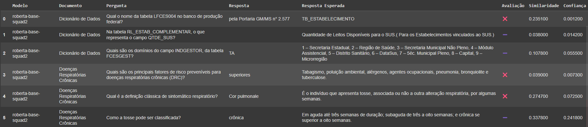

# Atividade 2: Aplicação de Modelos de QA em Documentos com Hugging Face

**Disciplina:** Processamento de Linguagem Natural  
**Instituição:** Universidade Federal de Sergipe

## Equipe

- José Batista
- Carlos Melo
- Roberdan Tamyr
- Arthur Matheus

## Sumário

- [1. Introdução](#1-introdução)
- [2. Descrição da Atividade](#2-descrição-da-atividade)
- [3. Metodologia](#3-metodologia)
  - [3.1. Configuração do Ambiente](#31-configuração-do-ambiente)
  - [3.2. Extração e Processamento do Texto](#32-extração-de-conteúdo-dos-documentos)
  - [3.3. Experimentos Realizados](#33-experimentos-realizados)
  - [3.4. Critérios de Avaliação](#34-critérios-de-avaliação)
- [4. Resultados e Análise](#4-resultados-e-análise)
  - [4.1. Experimento 1](#41-experimento-1)
  - [4.2. Experimento 2](#42-experimento-2)
  - [4.3. Experimento 3](#43-experimento-3)
- [5. Conclusão](#5-conclusão)
- [6. Referências](#6-referências)
- [7. Repositório](#7-repositório)
- [8. Notebook](#8-notebook)
- [9. Vídeo](#9-vídeo)
- [10. Participação](#10-participação)

---

## 1. Introdução

Este documento detalha a implementação e avaliação de um sistema de Perguntas e Respostas (Question Answering - QA) que utiliza modelos de Linguagem Natural (LLMs) disponíveis na plataforma Hugging Face. A atividade tem como objetivo extrair informações de documentos nos formatos DOCX e PDF para responder a perguntas específicas, comparando a eficácia de diferentes modelos de PLN.

Este documento apresenta três experimentos distintos no contexto de Perguntas e Respostas (QA) aplicados a documentos em formato DOCX e PDF. O foco é explorar o impacto de diferentes abordagens de recuperação de contexto e uso de Modelos de Linguagem de Grande Porte (LLMs) sobre o desempenho final.

---

## 2. Descrição da Atividade

A atividade consiste na criação de um script em Python, no formato de um Notebook do Google Colab, para implementar um sistema de Perguntas e Respostas. A base de conhecimento para o sistema são dois documentos fornecidos: **“DICIONARIO_DE_DADOS.docx”** e **“doencas_respiratorias_cronicas.pdf”**.

O processo envolve a seleção de, no mínimo, três modelos gratuitos da plataforma Hugging Face. Para cada um dos dois documentos, foram elaboradas três perguntas distintas, totalizando seis perguntas para o teste de cada modelo.

O principal objetivo é comparar o desempenho dos modelos, avaliando a precisão e o alinhamento das respostas em relação ao conteúdo dos textos de referência. A avaliação de desempenho é apresentada através de uma tabela comparativa detalhada e um gráfico visual, destacando a efetividade de cada modelo e os critérios utilizados para a comparação.

A atividade foi organizada em três experimentos:

- **Experimento 1(Baseline com QA)**: Utilização de três modelos de Question Answering do Hugging Face, aplicados diretamente sobre o texto integral dos documentos.
- **Experimento 2 (RAG com Embeddings)**: Implementação de RAG com embeddings (paraphrase-multilingual-mpnet-base-v2) e FAISS, para fornecer trechos relevantes dos documentos aos modelos de QA.
- **Experimento 3 (RAG com Cross-Encoder + LLMs)**: Extensão do RAG com reordenação via cross-encoder (ms-marco-MiniLM-L-6-v2), utilizando llms.

---

## 3. Metodologia

A metodologia foi estruturada em 4 etapas principais: configuração do ambiente, extração e processamento do texto dos documentos, realização dos experimentos e, por fim, a avaliação dos resultados.

### 3.1. Configuração do Ambiente

O ambiente de desenvolvimento foi configurado no Google Colab, garantindo a reprodutibilidade do projeto. As bibliotecas essenciais para a manipulação de arquivos, processamento de linguagem natural e visualização de dados foram instaladas, assim como bibliotecas Hugging Face Transformers, FAISS e Sentence-Transformers.

**Instalação de dependências:**

```python
# Instalação de arquivos necessários
!pip install python-docx -q
!pip install pymupdf -q
!pip install sentence-transformers -q
!pip install faiss-cpu -q
!pip install transformers -q
!pip install accelerate  -q
!pip install bitsandbytes -q
!pip install pandas -q
!pip install matplotlib -q
!pip install langchain -q
!pip install huggingface_hub
```

### 3.2. Extração de Conteúdo dos Documentos

Para que os modelos pudessem processar as informações, o texto foi extraído dos arquivos DOCX e PDF. Foram criadas funções específicas para cada tipo de arquivo, utilizando as bibliotecas `python-docx` e `PyMuPDF`.

**Código de Extração:**

```python
# Extração de texto do .docx
def extract_text_from_docx(file_path):
    doc = Document(file_path)
    full_text = []
    for para in doc.paragraphs:
        full_text.append(para.text)
    for table in doc.tables:
        for row in table.rows:
            for cell in row.cells:
                full_text.append(cell.text)
    return '\n'.join(full_text)


# Extração de texto do .pdf
def extract_text_from_pdf(file_path):
    doc = fitz.open(file_path)
    full_text = []
    for page in doc:
        full_text.append(page.get_text())
    return '\n'.join(full_text)
```

Como os modelos de QA possuem uma limitação no tamanho do contexto que podem processar de uma só vez, os textos extraídos foram divididos em blocos menores (chunks) para garantir que nenhuma informação fosse perdida durante a análise.

### 3.3. Experimentos Realizados

- **Experimento 1(Baseline com QA)**: Utilização de três modelos de Question Answering do Hugging Face, aplicados diretamente sobre o texto integral dos documentos.Para isso, o documento é dividido em chunks de texto, e a mesma pergunta é realizada em todos os chunks. Este experimento corresponde à primeira versão da tarefa, realizada antes das sugestões fornecidas pelo professor em aula. Uma descrição mais detalhada dessa versão inicial pode ser consultada no seguinte link: [Arthur_Lima_atividade2_v1.docx](https://docs.google.com/document/d/1q2rOGUq5_8dpt74ry1nd_KeMMwLv05G6/edit?usp=sharing&ouid=109641451200619281802&rtpof=true&sd=true).
- **Experimento 2 (RAG com Embeddings)**: Após as recomendações do professor, implementamos a técnica de Retrieval Augmente Generation (RAG), utilizando o modelo de embeddings paraphrase-multilingual-mpnet-base-v2 para representação vetorial dos trechos do texto. Foi criado um banco de dados vetorial com FAISS e, para cada pergunta, os cinco trechos mais semelhantes foram recuperados e utilizados como contexto para os modelos de QA.

- **Experimento 3 (RAG com Cross-Encoder + LLMs)**: Como extensão da estratégia anterior, recuperamos os 10 trechos mais semelhantes e aplicamos um cross-encoder (ms-marco-MiniLM-L-6-v2) para reordená-los por relevância. Os três melhores foram então utilizados como contexto para os LLMs (google/gemma-2b-it, meta-llama/Llama-3.2-1B-Instruct e meta-llama/Llama-3.2-3B-Instruct).

### 3.4. Critérios de Avaliação

A avaliação da efetividade dos modelos foi baseada em três critérios:

1.  **Avaliação Manual:** As respostas geradas foram classificadas manualmente em três categorias para uma análise qualitativa rápida:

    - **✔️ (Correta):** A resposta do modelo é idêntica ou semanticamente equivalente à resposta esperada.
    - **➖ (Parcialmente Correta):** A resposta contém parte da informação correta, mas está incompleta ou imprecisa.
    - **❌ (Incorreta):** A resposta está errada ou não tem relação com a pergunta.

2.  **Similaridade Semântica (Cosseno):** Para uma avaliação quantitativa, a similaridade de cosseno entre os _embeddings_ da resposta do modelo e da resposta esperada foi calculada. Utilizou-se o modelo `sentence-transformers/all-MiniLM-L6-v2` para gerar os _embeddings_. Essa métrica varia de -1 a 1, onde valores mais próximos de 1 indicam maior similaridade semântica.

3.  **Confiança do Modelo:** A pontuação de confiança (`score`) retornada pelo próprio modelo de QA foi registrada. Este valor indica o quão confiante o modelo está em sua própria resposta. Essa pontuação esta ausente nas llms.

## 4. Resultados e Análise

Os resultados da avaliação foram compilados em tabelas detalhadas para cada modelo e em um gráfico comparativo para facilitar a análise.

### 4.1. Experimento 1

As tabelas a seguir exibem os resultados detalhados para cada modelo, incluindo a pergunta, a resposta gerada, a resposta esperada e as métricas de avaliação.

**Resultados para: `roberta-base-squad2`**


**Resultados para: `distilbert-base-cased-distilled-squad`**


**Resultados para: `mdeberta-v3-base-squad2`**


O gráfico de barras empilhadas abaixo resume a avaliação manual, mostrando a quantidade de respostas corretas, parcialmente corretas e incorretas para cada modelo.

**Gráfico para: `Experimento 1**


### 4.2. Experimento 2

As tabelas a seguir exibem os resultados detalhados para cada modelo, incluindo a pergunta, a resposta gerada, a resposta esperada e as métricas de avaliação.

**Resultados para: `roberta-base-squad2`**



**Resultados para: `distilbert-base-cased-distilled-squad`**


**Resultados para: `mdeberta-v3-base-squad2`**


O gráfico de barras empilhadas abaixo resume a avaliação manual, mostrando a quantidade de respostas corretas, parcialmente corretas e incorretas para cada modelo.

**Gráfico para: `Experimento 2**


### 4.3. Experimento 3

As tabelas a seguir exibem os resultados detalhados para cada modelo, incluindo a pergunta, a resposta gerada, a resposta esperada e as métricas de avaliação.

**Resultados para: `gemma-2b-it`**


**Resultados para: `Llama-3.2-1B-Instruct`**


**Resultados para: `Llama-3.2-3B-Instruct`**


O gráfico de barras empilhadas abaixo resume a avaliação manual, mostrando a quantidade de respostas corretas, parcialmente corretas e incorretas para cada modelo.

**Gráfico para: `Experimento 3**


## 5. Conclusão

A análise dos três experimentos revelou diferentes trade-offs entre eficiência e precisão nas estratégias de Question Answering.

O **Experimento 1** utilizou uma abordagem de "força bruta", aplicando os modelos de QA em todos os trechos do documento. Apesar do alto custo computacional e tempo de processamento crescente, esta estratégia apresentou os melhores resultados em precisão.

O **Experimento 2** implementou RAG para uma abordagem mais realista, selecionando apenas trechos relevantes para análise. Isso resultou em significativa melhoria no tempo de processamento, porém com desempenho inferior devido à qualidade limitada do sistema de recuperação.

O **Experimento 3** expandiu o RAG com mais trechos candidatos e reranking via cross-encoder antes de utilizar LLMs. Mesmo com maior sofisticação técnica, não superou o baseline do primeiro experimento.

O fator limitante dos Experimentos 2 e 3 foi a eficácia do sistema RAG, que nem sempre identificou os trechos mais informativos, especialmente em estruturas tabulares. O modelo `timpal0l/mdeberta-v3-base-squad2` destacou-se consistentemente, demonstrando superior capacidade multilíngue.

Melhorias no sistema RAG - incluindo estratégias de chunking mais sofisticadas e embeddings específicos do domínio - poderiam elevar significativamente o desempenho dos experimentos com RAG, tornando-os competitivos com a abordagem de força bruta.

---

## 6. Referências

### Bibliotecas e Frameworks

- **Hugging Face Transformers**: Biblioteca para modelos de transformers pré-treinados. Disponível em: https://huggingface.co/docs/transformers
- **Sentence Transformers**: Framework para embeddings semânticos usando transformers. Disponível em: https://huggingface.co/sentence-transformers
- **FAISS (Facebook AI Similarity Search)**: Biblioteca para busca eficiente de similaridade em grandes conjuntos de dados. Disponível em: https://github.com/facebookresearch/faiss

### Modelos de Question Answering (Experimentos 1 e 2)

- **RoBERTa Base SQuAD2**: `deepset/roberta-base-squad2`. Disponível em: https://huggingface.co/deepset/roberta-base-squad2
- **DistilBERT Base SQuAD**: `distilbert-base-cased-distilled-squad`. Disponível em: https://huggingface.co/distilbert-base-cased-distilled-squad
- **mDeBERTa v3 Base SQuAD2**: `timpal0l/mdeberta-v3-base-squad2`. Disponível em: https://huggingface.co/timpal0l/mdeberta-v3-base-squad2

### Modelos de Embeddings e Reranking

- **Paraphrase Multilingual MPNet**: `sentence-transformers/paraphrase-multilingual-mpnet-base-v2`. Disponível em: https://huggingface.co/sentence-transformers/paraphrase-multilingual-mpnet-base-v2
- **MS MARCO MiniLM Cross-Encoder**: `cross-encoder/ms-marco-MiniLM-L-6-v2`. Disponível em: https://huggingface.co/cross-encoder/ms-marco-MiniLM-L-6-v2
- **All-MiniLM-L6-v2** (para similaridade semântica): `sentence-transformers/all-MiniLM-L6-v2`. Disponível em: https://huggingface.co/sentence-transformers/all-MiniLM-L6-v2

### Large Language Models (Experimento 3)

- **Gemma 2B Instruct**: `google/gemma-2b-it`. Disponível em: https://huggingface.co/google/gemma-2b-it
- **Llama 3.2 1B Instruct**: `meta-llama/Llama-3.2-1B-Instruct`. Disponível em: https://huggingface.co/meta-llama/Llama-3.2-1B-Instruct
- **Llama 3.2 3B Instruct**: `meta-llama/Llama-3.2-3B-Instruct`. Disponível em: https://huggingface.co/meta-llama/Llama-3.2-3B-Instruct

### Artigos e Metodologias

- **RAG (Retrieval-Augmented Generation)**: Lewis, P. et al. (2020). "Retrieval-Augmented Generation for Knowledge-Intensive NLP Tasks". _arXiv preprint arXiv:2005.11401_. Disponível em: https://arxiv.org/abs/2005.11401
- **Cross-Encoders for Information Retrieval**: Reimers, N. & Gurevych, I. (2019). "Sentence-BERT: Sentence Embeddings using Siamese BERT-Networks". _arXiv preprint arXiv:1908.10084_. Disponível em: https://arxiv.org/abs/1908.10084

## 7. Repositório

- [PLN_QA_LLM_2025](https://github.com/shykiu77/PLN_QA_LLM_2025_Melo_Carlos)

## 8. Notebook

- **Versão 1**: [PLN_QA_LLM_v1_2025](https://colab.research.google.com/drive/1v7O56jkR_l8kB-sMQdtzuRnsvMM4CG5B?usp=sharing)
- **Versão 2**: [PLN_QA_LLM_v2_2025](https://colab.research.google.com/drive/1fdpZu_C6IEDouc1gf7OntnShtuxF2a3M?usp=sharing)

## 9. Vídeo

- [URL para o vídeo da apresentação]

## 10. Participação

- Arthur Matheus: Implementação do código e escrita do documento
- Carlos Melo: Escrita do documento, Implementação do RAG
